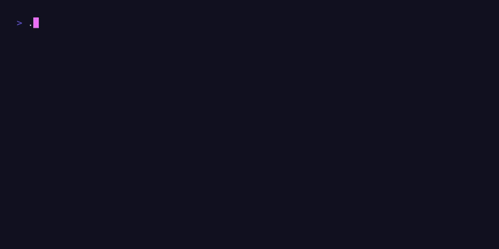

<p align="center">
  
</p>

<h1 align="center">SnowFastULP</h1>

[](https://github.com/snowx-dev/SnowFastULP)
[](https://go.dev/)
[](#try-it)
[](https://snowfast.todo/docs)
[](https://github.com/snowx-dev/SnowFastULP/actions/workflows/ci.yml)
[](https://github.com/snowx-dev/SnowFastULP/releases/latest)

SnowFastULP cleans big ULP `.txt` dumps fast, without filling your RAM.

Three commands:

- `sfu`: clean and deduplicate ULP/LPU `.txt` files.
- `sfs`: search plain text or `.zst` archives.
- `sfl`: pull ULP lines out of stealer-log folders and archives.

<p align="center">
  
</p>

## Try it

```bash
curl -fsSL https://raw.githubusercontent.com/snowx-dev/SnowFastULP/main/scripts/install.sh | bash
sfu ./dump.txt -o ./cleaned/
```

Point `sfu` at a file or folder, keep the result somewhere useful. That is the whole first run.

## Why people keep it around

- **Build an antipublic.** `sfu -od ./library/` turns repeat dumps into one compressed, deduped, searchable archive. Later runs skip lines already in the library.
- **Search compressed archives.** `sfs ./library "facebook.com:"` queries `.zst` without decompressing first.
- **Stealer logs in, ULP out.** `sfl` walks extracted folders and passworded zip/rar/7z archives, recurses nested archives, and merges into your library.
- **Secret scanning built in.** Flag tokens and keys during extraction.
- **Low RAM, big inputs.** Two-pass disk bucketing keeps memory flat on huge dumps.

<p align="center">
  
</p>

Flags, config, build, FAQ, and the full `sfu` / `sfs` / `sfl` references live in the docs:

→ **https://snowfast.todo/docs**

## Shoutouts

- [vulnerose](https://t.me/aeryals) // Parser inspo
- [Prequel](https://eternally.blue) // Search inspo
- [lateralmovement](https://guns.lol/lateralmovement) // Cleaner inspo + data golbin
- Duckyhax // Beta testing

## License

SnowFastULP is licensed under the [GNU Affero General Public License v3.0](LICENSE) (AGPL-3.0). Copyright (C) 2026 Snow Dev. Use it only with data you are allowed to process. No warranty.
